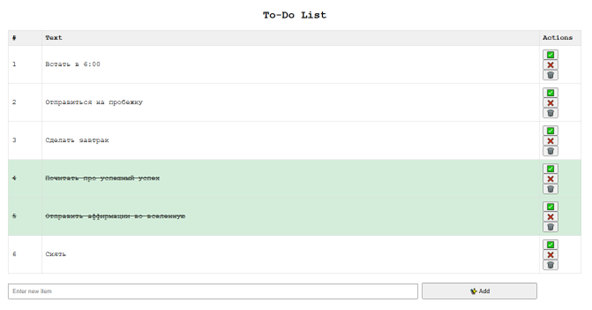
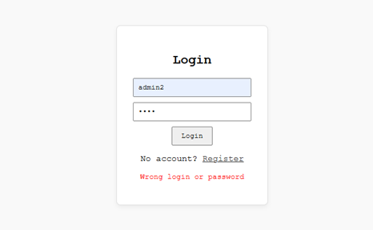
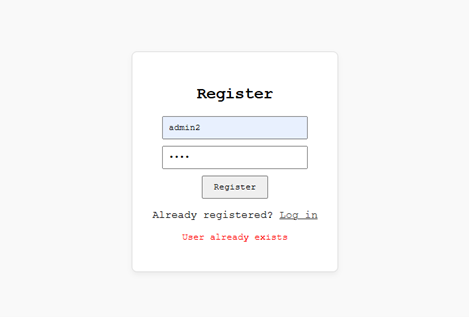
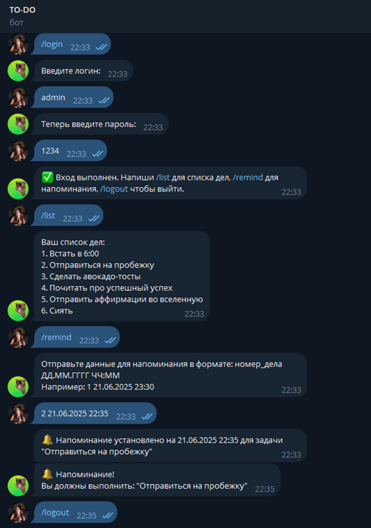

# 📝 To-Do List with Telegram Bot

**University Lab Project:** Full-stack web application with user authentication, task management, and Telegram bot integration.

## 🚀 Features

### 🌐 Web Application
- **User Authentication:** Registration and login pages
- **Task Management:** Basic CRUD-operations: Add, edit, delete, and mark tasks as completed
- **Simple UI:** Basic HTML interface

### 🤖 Telegram Bot
- **Task Viewing:** See your tasks from Telegram
- **Reminders:** Set reminders for tasks

### 🐳 DevOps & Deployment
- **Docker:** Containerized setup
- **MySQL:** Database for storing data

## 🛠️ Technology Stack

**Frontend:**
- HTML (index.html, login.html, register.html)
- Vanilla JavaScript

**Backend:**
- Node.js with Express (index.js)
- MySQL Database

**Telegram Bot:**
- Node.js (bot.js)
- Telegram Bot API

**Infrastructure:**
- Docker & Docker Compose
- MySQL 8.0

## 📦 Project Structure  
todolist/  
├── index.html # Main page with tasks  
├── login.html # Login page  
├── register.html # Registration page  
├── index.js # Node.js server  
├── bot.js # Telegram bot  
├── init.sql # Database schema  
├── Dockerfile # Docker configuration  
├── docker-compose.yml # Multi-container setup  
├── package.json # Node.js dependencies  
├── package-lock.json # Dependency lock file  
├── .env.example # Environment template  
├── README.md # Documentation  
├── LICENSE # MIT License  
└── .gitignore # Git ignore rules  

## 🚀 Quick Start

### Prerequisites
- Docker & Docker Compose
- Telegram Bot Token (from @BotFather)

### Installation

1. **Clone the repository:**
   ```bash
   git clone https://github.com/aok-m/ToDoList-site-Telegram-bot-LabWork.git
   cd todo-list-telegram-bot
 
2. **Configure environment:**
    ```bash
    cp .env.example .env
    # Edit .env with your database password and bot token

3. **Start the application:**
    ```bash
    docker-compose up -d --build

4. **Open in browser:**
    Main page: http://localhost:3000

    Login: http://localhost:3000/login.html

    Register: http://localhost:3000/register.html

## 🔧 How It Works

### Web Application
1. **Registration:** Users create an account at `/register.html`
2. **Login:** Users log in at `/login.html`
3. **Task Management:** After login, users can:
   - Add new tasks
   - Mark tasks as completed
   - Edit task text
   - Delete tasks

### Database
Three main tables:
- **users** - stores user credentials
- **items** - stores todo items
- **reminders** - stores task reminders

### Telegram Bot
Basic commands:
- `/start` - begin interaction
- `/login` - authenticate with web app credentials
- `/tasks` - view your todo list
- `/remind` - set a reminder for a task

## 📸 Screenshots






## 📚 Academic Purpose

This project was developed to fulfill university course requirements demonstrating:
- Basic web development with HTML/JavaScript
- Server-side programming with Node.js
- Database integration with MySQL
- Third-party API integration (Telegram)
- Containerization with Docker

## 🐛 Troubleshooting

### Common Issues

1. **Port already in use:**
   ```bash
   # Change port in docker-compose.yml
   ports:
     - "3001:3000"  # Use port 3001 instead of 3000

2. **Database connection errors:**

    - Check if MySQL container is running: docker-compose ps

    - Verify .env file has correct password

3. **Bot not responding:**

    - Ensure bot token in .env is correct

    - Check bot logs: docker-compose logs bot

### Useful Commands

```bash
# View logs
docker-compose logs -f app
docker-compose logs -f bot

# Restart services
docker-compose restart app
docker-compose restart bot

# Stop everything
docker-compose down

# Stop and remove everything including volumes
docker-compose down -v
```

### 📄 License
MIT License - see [LICENSE](LICENSE) file for details.

### 👤 Author
**Anna A. Petukhova**